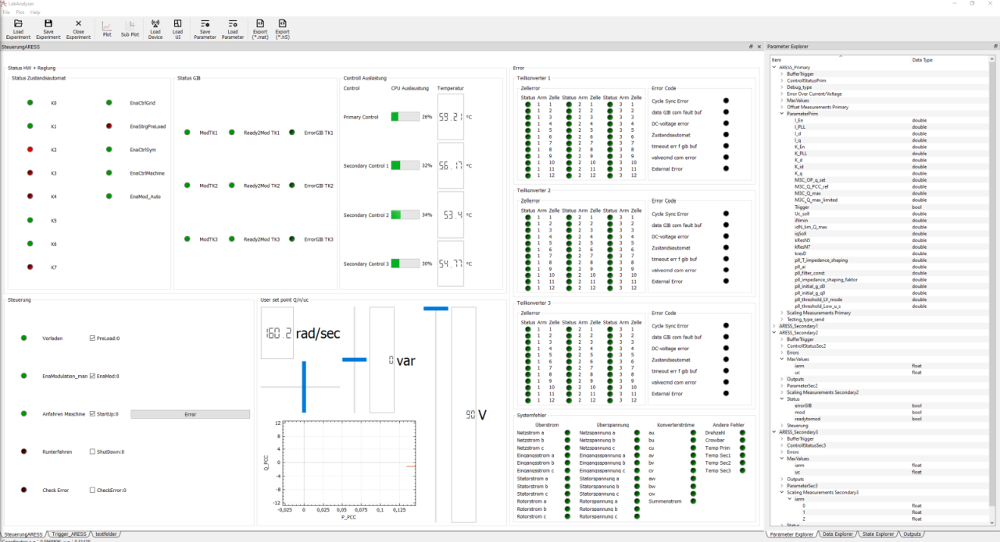

# LabAnalyser
A plugin based open source data modification and visualization tool

## How to compile LabAnalyser (using msys2)

1. pacman -Syuu
2. pacman -Syuu
3. pacman -Syuu
4. mingw-w64-i686-qt
5. mingw-w64-i686-qt-creator
6. mingw-w64-x86_64-qt
7. mingw-w64-x86_64-qt-creator
8. pacman -S mingw-w64-x86_64-boost
9. pacman -S mingw-w64-x86_64-highfive
10. pacman -S git

11. open MinGW-w64 32-Bit- or 64-Bit-Shell and call "qtcreator" 

### Prerequisites

The following libraries are necessary: 
1. boost_1_59_0 (https://www.boost.org/)
2. matOut (https://github.com/EyNuel/matOut/)
	to use MatOut please use the git patch in folder build-patches:
3. hdf5-1.10.5 (https://github.com/HDFGroup/hdf5/)
4. HighFive (https://github.com/BlueBrain/HighFive/)

### Steps  
(tested on Arch Linux)

1. install boost-libs 
   - Arch Linux: `pacman -S boost-libs`
2. install HighFive
   - Arch Linux: install from AUR `yay -S highfive` or `yaourt -S highfive`
3. create build folder `mkdir build`
4. create libs folder build/libs/ `mkdir build/libs/`
5. `cd build/libs`
6. `clone https://github.com/EyNuel/matOut.git` 
7. `cd matOut`
8. `patch < ../../../build-patches/MatOut-0001-Changes-to-use-the-lib-in-LabAnalyser.patch`
9.  change folder to build: `cd ../../`
10. run qmake inside build: `qmake ../`
11. run make: `make`
12. if successful: execude LabAnalyser `./LabAnalyser`

