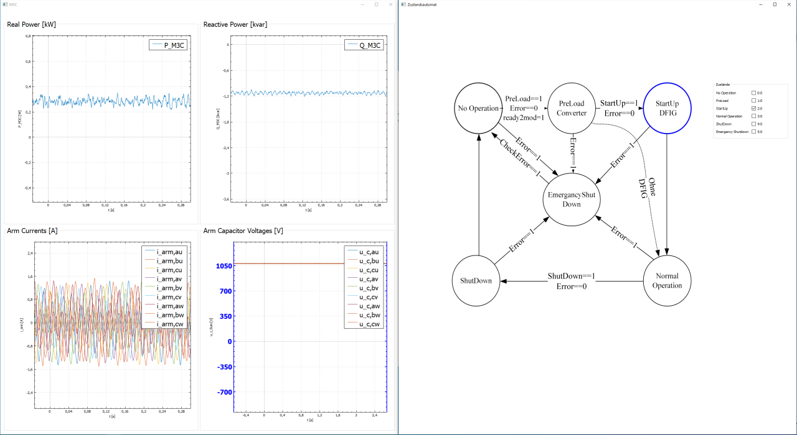
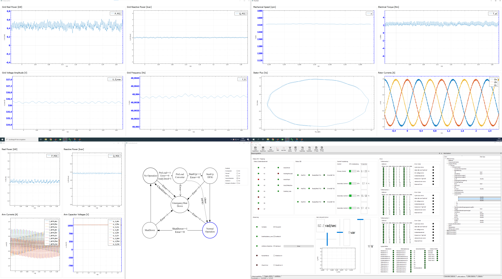
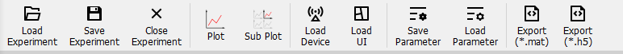

**Table of content**

- [Functionality of LabAnalyser](#functionality-of-labanalyser)
  * [How to compile LabAnalyser](#how-to-compile-labanalyser)
    + [For Windows](#for-windows)
    + [For Linux (tested on Arch Linux)](#for-linux)
  * [Known Bugs](#known-bugs)

# Functionality of LabAnalyser
A plugin based open source data modification and visualization tool

____________
____________

**Create editable variales (parameter) or data in a plugin (see https://github.com/ConverterLabs/PluginTemplate) and use the visualization of LabAnalyser.
Create UserInterfaces with QTCreator load them in LabAnalyser and connect the elements with variables via drag and drop.**

____________
____________

**Use the signal slot system of qt in QTCreator to create sophisticated user interfaces.**

____________
____________

**Load as many user interfaces as needed to LabAnalyser. And visualize hundreds of thousands of data points in realtime.**

____________
____________

**Use features as export to HDF5 or Matlab-File (*.mat) so store the data. Or directly connect Matlab via TCP/IP.**

____________
____________

# How to compile LabAnalyser 

## For Windows 
Use msys2, install necessary packages as flollows:

1. `pacman -Syuu`
2. `pacman -Syuu`
3. `pacman -Syuu`
5. `pacman -S mingw-w64-x86_64-qt6`
6. `pacman -S mingw-w64-x86_64-qt-creator`
7. `pacman -S mingw-w64-x86_64-boost`
8. `pacman -S mingw-w64-x86_64-highfive`
9. `pacman -S mingw-w64-x86_64-fftw`
10. `pacman -S git`
11. clone https://github.com/EyNuel/matOut.git
12. use patch < ../../../build-patches/MatOut-0001-Changes-to-use-the-lib-in-LabAnalyser.patch
13. open MinGW-w64 32-Bit- or 64-Bit-Shell and call "qtcreator" 
14. open LabAnalyser.pro

## For Linux
 (tested on Arch Linux)
 
1. install boost-libs 
   - Arch Linux: `pacman -S boost-libs`
2. install HighFive
   - Arch Linux: install from AUR `yay -S highfive` or `yaourt -S highfive`
3. create build folder `mkdir build`
4. create libs folder build/libs/ `mkdir build/libs/`
5. `cd build/libs`
6. `clone https://github.com/EyNuel/matOut.git` 
7. `cd matOut`
8. `patch < ../../../build-patches/MatOut-0001-Changes-to-use-the-lib-in-LabAnalyser.patch`
9.  change folder to build: `cd ../../`
10. run qmake inside build: `qmake ../`
11. run make: `make`
12. if successful: execude LabAnalyser `./LabAnalyser`

# Known Bugs

If you change the monitor array or the system, LabAnalyser might crash due to a bug in QMainWindow::restoreState of QT. To load the project open the corresponding .LAexp file with a text-editor and remove the line next to the last containing the window state `<State> ....  </State>`.
