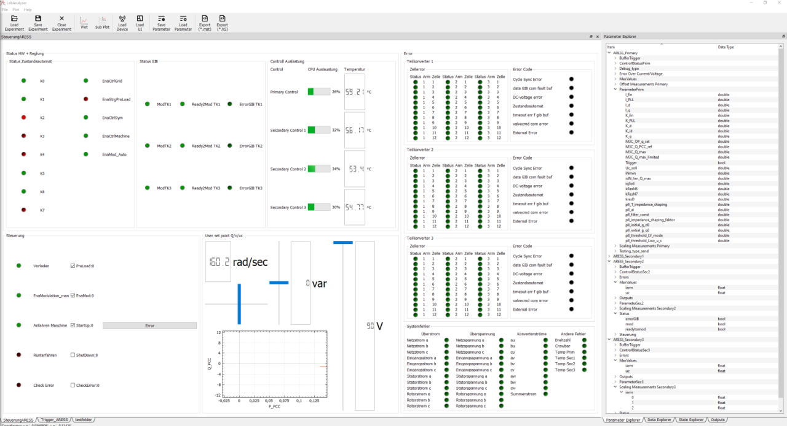
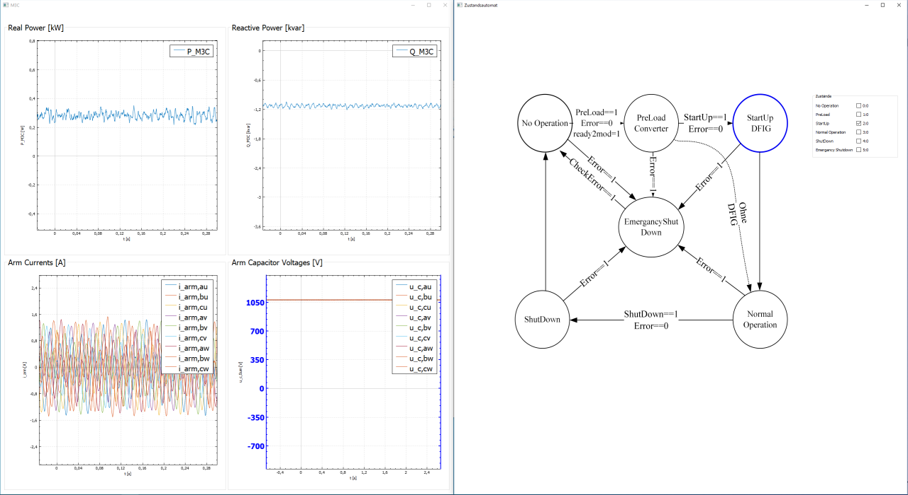
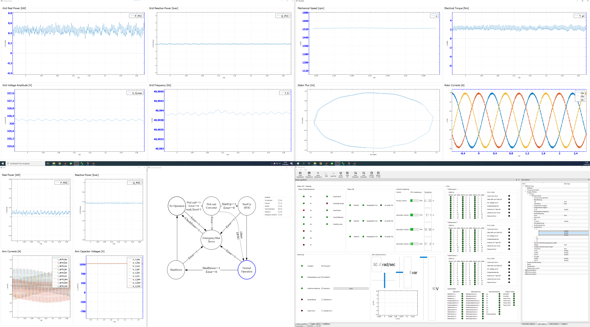
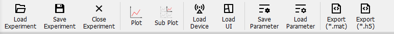

**Table of Contents**

- [Functionality of LabAnalyser](#functionality-of-labanalyser)
  * [How to Compile LabAnalyser](#how-to-compile-labanalyser)
    + [For Windows](#for-windows)
    + [For Linux (Tested on Arch Linux)](#for-linux)
  * [Known Bugs](#known-bugs)

# Functionality of LabAnalyser

LabAnalyser is a plugin-based, open-source tool for data modification and visualization.

---

**Create editable variables (parameters) or data within a plugin (refer to https://github.com/ConverterLabs/PluginTemplate) and utilize LabAnalyser for visualization.
Design user interfaces with QTCreator, load them into LabAnalyser, and link the UI elements to variables using a drag-and-drop mechanism.**


---

**Employ the signal-slot system of Qt in QTCreator to develop sophisticated user interfaces.**



---

**Load multiple user interfaces as required into LabAnalyser to visualize data points in real-time, scaling to hundreds of thousands.**


---

**Leverage features such as export to HDF5 or MATLAB files (*.mat) for data storage, or establish a direct connection to MATLAB via TCP/IP.**


---

# How to Compile LabAnalyser

## For Windows

Follow these steps using MSYS2, and install the necessary packages:

1. `pacman -Syuu` (run as required to update MSYS2)
2. `pacman -S --needed base-devel mingw-w64-x86_64-toolchain`
3. `pacman -S mingw-w64-x86_64-qt6`
4. `pacman -S mingw-w64-x86_64-qt-creator`
5. `pacman -S mingw-w64-x86_64-boost`
6. `pacman -S mingw-w64-x86_64-highfive`
7. `pacman -S mingw-w64-x86_64-fftw`
8. `pacman -S git`
9. Install matio: `pacman -S mingw-w64-x86_64-matio`
10. Open the MinGW-w64 64-Bit Shell and launch `qtcreator`.
11. Open `LabAnalyser.pro`.

The MATLAB MAT-file export uses [matio](https://github.com/tbeu/matio). The
former `matOut` dependency is no longer required.

For a scripted build, run this from the repository root in PowerShell:

```powershell
.\scripts\build-msys2.ps1 -Configuration release -Clean -Deploy
```

The compilation files are kept in the separate build directory:

```text
build\msys2-mingw64-release\release
```

`-Deploy` creates a clean standalone directory at:

```text
dist\LabAnalyser-release
```

The deployment directory contains `LabAnalyser.exe`, the Qt runtime, the MinGW
compiler runtime, the required HDF5, FFTW, and matio DLLs, and their native
transitive dependencies. It does not contain qmake files, object files, or
other build output. The directory is removed and recreated on every
`-Deploy` run.

If PowerShell blocks local scripts because of the execution policy, run the
same build with a process-local policy override:

```powershell
powershell.exe -NoProfile -ExecutionPolicy Bypass -File .\scripts\build-msys2.ps1 -Configuration release -Clean -Deploy
```

## For Linux (Tested on Arch Linux)

1. Install the required development packages using the distribution package
   manager:
   - Qt 6, Boost, HighFive, matio, FFTW, and HDF5
2. Prepare the build environment:
   - `mkdir -p build/linux && cd build/linux`
   - `qmake ../../LabAnalyser.pro`
   - `make -j$(nproc)`
   - If successful, execute: `./LabAnalyser`

## Jenkins build

The Jenkins controller can run on Ubuntu. The build itself should run on a
Windows Jenkins agent with the MSYS2 MINGW64 toolchain installed. This avoids
maintaining a separate Linux-to-Windows cross-compilation toolchain.

Configure the Windows agent with the label `windows-msys2` and make sure the
repository is available there. The agent needs the same MSYS2 packages listed
above, including `mingw-w64-x86_64-matio`.

Create a Pipeline job using the repository's `Jenkinsfile`. The pipeline runs:

```powershell
.\scripts\build-msys2.ps1 -Configuration release -Clean -Deploy
```

The resulting `dist\LabAnalyser-release` directory contains `LabAnalyser.exe`
and the required Qt, MinGW, HDF5, FFTW, and matio DLLs and can be published as
a Jenkins artifact.

# Known Bugs

Changing the monitor array or the system configuration may cause LabAnalyser to crash due to a bug in `QMainWindow::restoreState` of Qt. To resolve this, open the corresponding .LAexp file with a text editor and remove the line just before the last one containing the window state `<State> .... </State>`.
